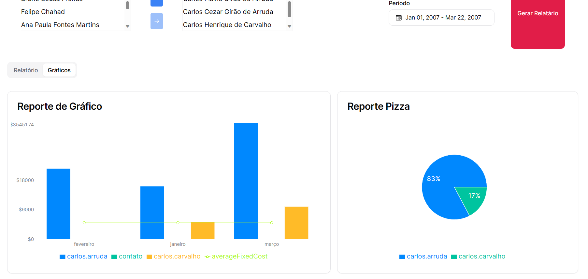

# Projeto Web Caol

O Projeto é uma aplicacao de análise do desempenho dos consultores de uma empresa. Ele oferece uma variedade de funcionalidades para acessar informações sobre os consultores, gerar relatórios, gráficos.

## Recursos da Aba Consultor

### Lista de Consultores

- Para listar os consultores, o sistema utiliza duas tabelas: CAO_USUARIO e PERMISSAO_SISTEMA, realizando uma operação de junção com base em CO_USUARIO.
- Os filtros podem ser aplicados com base nas seguintes condições na tabela PERMISSAO_SISTEMA: CO_SISTEMA = 1, IN_ATIVO = S e CO_TIPO_USUARIO = 0, 1, 2.

### Relatório - Objetivo

- O objetivo deste relatório é apresentar, de forma separada por consultor, os resultados das receitas geradas por cada profissional. Isso é feito levando em consideração os consultores selecionados nos filtros.
- A informação de "receita líquida" do mês de referência é obtida somando as faturas emitidas relacionadas às Ordens de Serviço (OS) de cada consultor. A receita líquida é calculada subtraindo o valor total de impostos do valor da fatura.
- O custo fixo de cada consultor é obtido a partir da tabela CAO_SALARIO.
- A comissão de cada consultor é calculada com base no valor líquido das faturas emitidas e em um percentual de comissão definido na tabela.

### Gráfico - Objetivo

- O objetivo deste gráfico é apresentar o desempenho de cada consultor em formato gráfico, um ao lado do outro. Ele também inclui uma linha que representa o custo médio de todos os consultores, permitindo uma análise fácil para identificar se os desempenhos estão acima ou abaixo desse custo para a empresa.
- Para gerar a barra de ganhos, o sistema considera apenas o valor líquido das faturas, desconsiderando custos fixos e comissões.
- Ambos os eixos do gráfico têm valores máximos iguais para garantir a consistência na visualização.

### Pizza - Objetivo

- O objetivo deste gráfico circular é apresentar o percentual de receita líquida gerada por cada consultor em relação ao total de receita líquida gerada por todos os consultores envolvidos na consulta.
- Para calcular as fatias de receita, o sistema leva em consideração apenas o valor líquido das faturas e subtrai o valor total de impostos.

## Aba Cliente

O Projeto Web Aba Cliente oferece recursos semelhantes à Aba Consultor, mas com foco nos clientes da empresa. Ele permite listar os clientes, gerar relatórios, gráficos e análises detalhadas sobre a receita total gerada por cada cliente em diferentes meses de referência.

### Lista de Clientes

- Para listar os clientes, o sistema utiliza a tabela CAO_CLIENTE e aplica filtros com base na condição TP_CLIENTE = A.

### Relatório - Objetivo

- O objetivo deste relatório é apresentar, de forma separada por cliente, a receita total gerada para cada mês de referência. Isso é feito levando em consideração os clientes selecionados nos filtros.
- A informação de "receita líquida" de cada cliente para cada mês é obtida somando as faturas emitidas relacionadas às Ordens de Serviço (OS) de cada cliente. A receita líquida é calculada subtraindo o valor total de impostos do valor da fatura.

### Gráfico - Objetivo

- O objetivo deste gráfico de linhas é apresentar o desempenho em receita de cada cliente ao longo do tempo. Ele considera apenas o valor líquido das faturas, desconsiderando custos fixos e comissões.

### Pizza - Objetivo

- O objetivo deste gráfico circular é apresentar o percentual de receita líquida gerada por cada cliente em relação ao total de receita líquida gerada por todos os clientes envolvidos na consulta.

Tecnologias utilizadas:
- [React](https://pt-br.react.dev/) 
- [NextJS](https://nextjs.org/)
- [TypeScript](https://www.typescriptlang.org/)
- [Tailwind](https://tailwindcss.com/)
- [Prisma](https://www.prisma.io/)
- [Recharts](https://recharts.org/)
- [Vercel](https://vercel.com/)

---

## Autor
- Tomás Lillo Sanhueza [GitHub](https://github.com/TommiL90) - [LinkedIn](https://www.linkedin.com/in/tomasbenjamin/)
